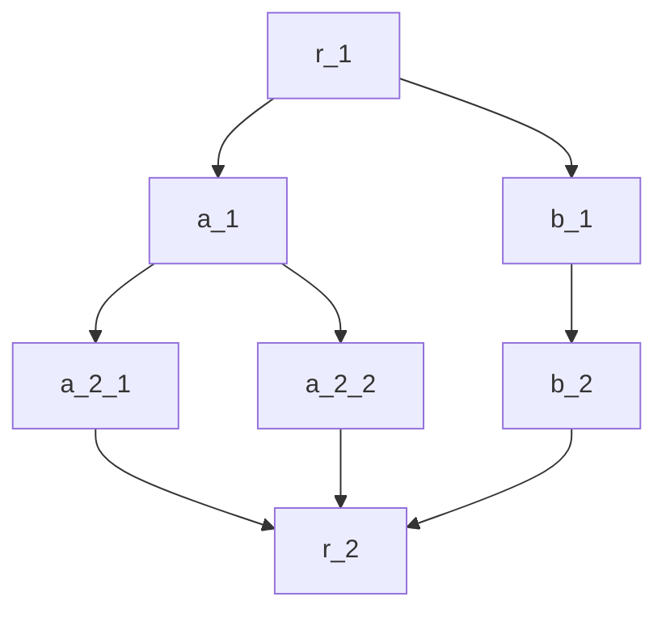

In the multi-branch example in the previous section, both branches may be skipped. To record the status of each branch and aggregate the results into the final result, many key-value pairs and complex `map` configurations are required.

In practical business scenarios, we find that this can be very cumbersome. This section introduces a best practice for sharing context.

## Custom Global Shared Struct



Define a struct in `r_1` that can record the results of all branches and write it to the `context` key:
```cpp
struct OurStruct{
    bool a_skiped = false;
    bool b_skiped = false;
    std::vector<float> a_result;
    at::Tensor b_result;
}

(*input)["context"] = std::make_shared<OurStruct>(); //input is a dict

```

In each branch, only process its own part of the data. In this way, we only need one key-value pair `context` to accommodate all data.
:::caution Data Race
Unless it is read-only, multiple branches are prohibited from accessing the same part of the `context`.
:::


## `context` Syntax Sugar in `map`

In the figure above, if `b_2` does not configure `map`, it will share the same data (`dict`) with `b_1`. If `a_2_1` does not configure `map`, it will get a copy of the data from `a_1`. As long as `map` is not configured, the node can always access `context`. However, when `map` is used, a brand new `dict` will be created and the specified key-value pairs will be copied over, which may not necessarily contain the `context` item.

:::info Syntax Sugar
For `map` configuration, if the data source has a `context` attribute and `map` does not have a mapping for `context`, `map` will automatically add a mapping for `context`.
:::