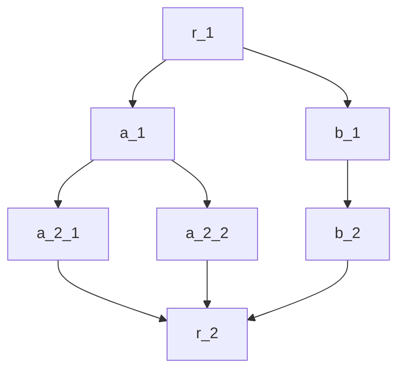

As introduced in [filter](../Intra-node/Sequential.mdx#filter_sequential) in Sequential, `filter` is a logical control instruction between nodes or backends, with the following states:
Run, Skip, SerialSkip, SubGraphSkip, Break, Error.

## Default Multi-Node Scheduler Interpretation of `filter` Return Values

In multi-node scheduling, the return values of `filter` represent:
- `Run`: the backend of the current node can be executed.
- `Skip`: the backend of the current node can be skipped, but it does not mean that the node has no result. The result of the node is the `dict` processed by `filter`.
- `Break`: the execution of the entire DAG is terminated, and the `dict` processed by `filter` is the final result.
- `Error`: an error occurred.
- `SerialSkip`: the largest serial subgraph can be skipped.
- `SubGraphSkip`: the largest independent subgraph can be skipped.

Consider the following directed acyclic graph:



In some scenarios, we want to skip the left branch (a_1 branch) or the right branch (b_1 branch) directly.

If the `filter` of a_1 returns `SubGraphSkip`, the largest independent subgraph rooted at a_1 (a_1, a_2_1, a_2_2) will be skipped.
If the `filter` of b_1 returns `SerialSkip`, the largest serial subgraph rooted at b_1 (b_1, b_2) will be skipped.

Independence means:
- All preceding nodes of non-root nodes in the subgraph are included in the subgraph.

"Skipping" has two meanings:
- Change the `next` of the subgraph root node to the union of the `next` of the subgraph leaf nodes.
- Forward the references to non-root nodes in the subgraph to the root node, that is, the entire subgraph is collapsed into a single point, the subgraph root node.

:::info Folding of Subgraphs
When a subgraph is folded, the non-root nodes in the subgraph are hidden. At this time, subsequent nodes seek to obtain data from them through `map`, which will automatically change to obtaining data from the subgraph root node.
:::

## Custom `filter`

We can customize `filter`. For example:

```cpp
#include "filter.hpp"

class your_filter : public Filter {
 public:
  status forward(dict data) override { 
    // handle data
    if (...)
    // highlight-next-line
        return status::SubGraphSkip;
    else
        return status::Run;     
    }
};
IPIPE_REGISTER(Filter, your_filter, "your_filter");
```

Custom `filter` can be obtained through [AOT compilation](../Intra-node/extensible_backend.mdx#compile).
```toml
[a_1]
filter="your_filter"
```

Please do not use the same name as built-in filters for custom filters.

## Built-in Filters {#default_filters}
|                                                                                                                                                     | Function                                                                                            |   |
|-----------------------------------------------------------------------------------------------------------------------------------------------------|-----------------------------------------------------------------------------------------------------|---|
| Run/run <br />Skip/skip <br />SerialSkip/serial_skip/serialskip <br />SubGraphSkip/subgraph_skip/subgraphskip, <br />Break/break, <br />Error/error | Returns the corresponding status value unconditionally                                              |   |
| swap                                                                                                                                                | Returns `Break` if there is no result, otherwise returns `Run`. Assign the value of result to data. |   |
| or                                                                                                                                                  | Returns `Run` if there is no result, otherwise returns `Skip`                                       |   |


 