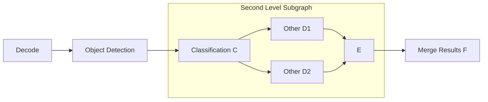
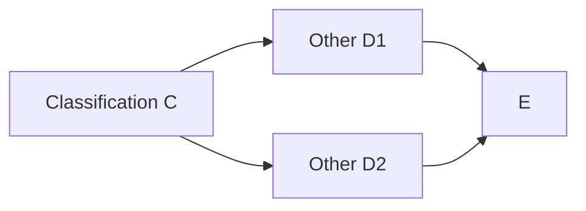
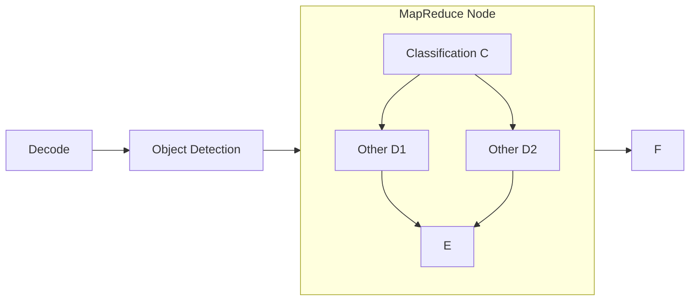
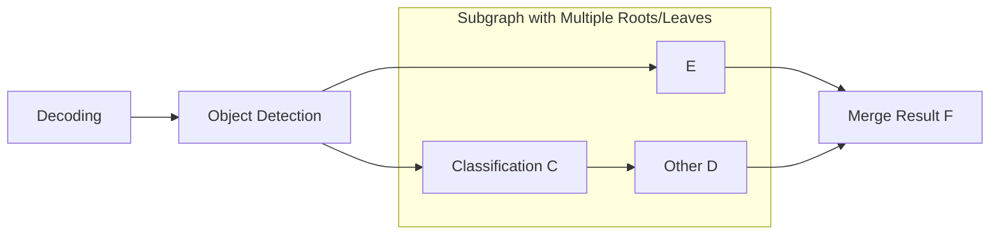

## Multi-level Structuring
Consider the following task in computer vision:


At first glance, it seems to form a complete directed acyclic graph, but in reality, the following problems exist:

- A. Object detection produces multiple sub-targets (sub-contexts) that enter CDE, and multiple sub-targets are merged in F.
- B. Sub-targets in CDE should be independent of each other and should not wait for each other to finish running a node before moving on to the next node.

Regarding A, we believe that the context has changed; the sub-context flows through the independent graph formed by CED. Regarding B, we believe that multiple sub-contexts at the same level do not necessarily need to be synchronized at the node.

CDE forms a subgraph in fact, but we find it difficult to design from a subgraph perspective. Essentially, we need to deal with a directed acyclic graph with directed acyclic graphs as nodes, which can be recursive.

We need users to split the graph into multiple parts and perform graph traversal between them.

## Graph Splitting
The original graph can be split into two parts.

Main Branch:


Where [MapReduce](#mapreduce) is a functional backend that splits data into sub-contexts and sends them to the following graph:



Then, multiple sub-contexts in E are merged together.

The overall graph is shown below, with the jump target treated as a node:




## Jump
Jump to another node (must be a root node).


:::caution
Context Switching For disconnected graphs, a multi-node scheduling system does not share node data contexts. 
:::

### Initialization

|        | Description                                                                | Note |
|--------|----------------------------------------------------------------------------|------|
| `jump` | The name of the root node of the target graph to jump to; only one allowed |      |


### min()/max()
[1, UINT32_MAX]

## MapReduce
MapReduce is a subclass of Jump that re-implements split and merge operations. MapReduce splits one input data into multiple sub-contexts (split operation), jumps to another graph for computation, and then merges multiple sub-contexts into one (merge operation) after all computations are completed.


### Initialization


|         | Description                                                                | Note                                                       |
|---------|----------------------------------------------------------------------------|------------------------------------------------------------|
| `split` | The key value to be split, separated by commas                             | Default value: "data", empty string means splitting itself |
| `merge` | The key value to be merged, separated by commas                            | Default value: "result", cannot be empty                   |
| `jump`  | The name of the root node of the target graph to jump to; only one allowed | Inherited from the base class Jump                         |


### Forward Computation

#### map

Copy the input data `dict` and split the data corresponding to the `split` key value. It is required that the data type corresponding to the `split` key value in the original data is `std::vector<T>`.

#### reduce
Merge the results according to the `merge` parameter, and the type of the merged result is `std::vector<any>`.


:::caution
If a sub-task fails (no `result` in the output), an exception will be thrown when merging the results in this way, causing all associated sub-tasks to fail. Generally, this behavior is acceptable; however, if it is necessary to allow sub-tasks without `result` that do not affect associated sub-tasks, the following measures can be considered:
- Re-implement the `merge` operation with a custom backend.
- Use context syntax (MapReduce does not automatically copy context when performing split/merge).
:::

### min()/max()
[1, UINT32_MAX]


## Customizing Split and Merge Operations

The default split and merge operations may not meet all requirements. We can inherit from Jump to customize these operations:

```cpp
#include "Jump.hpp"

class YourMapReduce : public ipipe::Jump{

  virtual std::vector<dict> split(dict data) override{
    // highlight-next-line
    return {data}; // <== Revise this implementation.
  }
  virtual dict merge(const std::vector<dict>& data) override{
    // highlight-next-line
    return data[0];// <== Revise this implementation.
  }

  //If there are custom initialization parameters, implement the following function:
  virtual bool post_init(const std::unordered_map<std::string, std::string>& config,
                         dict dict_config) override{
    return true;
  }
};
```
## Limitations
Currently, jumping to multiple nodes and merging multiple nodes is not supported. This means that the number of root nodes and leaf nodes in the target graph must be 1.

The following graph cannot be processed without adding intermediate nodes.



