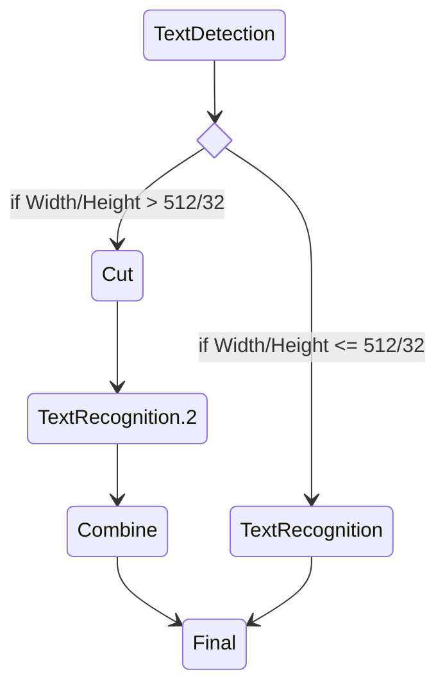

In some scenarios, it is necessary to enter certain nodes under different branches or logical control flow conditions, but without sharing their backends.




In the text recognition example above, we want the TextRecognition and TextRecognition.2 nodes to share the same backend instance. Using the node **name + alias** format, users can define logical nodes for physical nodes. Logical nodes can have separate logical configurations (next/filter/map) from their original physical nodes.


## Example

```toml
[in]
next="rec,rec.2"
[rec]
# default backend is Identity, which set 'result' = 'data'
next="final"
[rec.2]
next="final"
# this backend is not activated
# highlight-next-line
backend="C10Exception"
[final]
map="rec[result:data],rec.2[result:data.2]"
```

It is not difficult to test and find that:

```python
model  = torchpipe.pipe("assets/toml/logical.toml")

inputs = {"data":1}
model(inputs)
assert(inputs["result"]==inputs["data.2"])
```