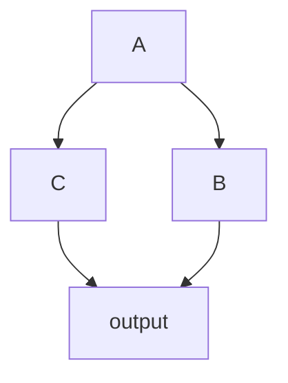

When using `Sequential` to serialize multiple backends, there are some issues:
- When switching input ranges, smaller backends cannot be fully executed in parallel.
- When the required hardware resources of the backend change, the hardware resources cannot be fully utilized.

`PipelineV3` is the default pipeline scheduling backend, which addresses the above issues and meets two additional requirements:
- Flexible data key value changes between backends
- Support for more complex directed acyclic graphs

This section mainly introduces how to link multiple nodes into a directed acyclic graph.

## Serial Nodes
The [`Sequential`](../Intra-node/Sequential.mdx)`[DecodeMat,ResizeMat]` backend encountered in the previous section can be represented in a multi-node manner as follows:
```toml
# irrelevant parameters are ignored 
[decode]
# highlight-next-line
next="resize"

[resize]
```


The `decode->resize` forms a directed acyclic graph consisting of two nodes, where `decode` is the root node and `resize` is the child node.

Similar to `Sequential`, the root node defaults to [filter](../Intra-node/Sequential.mdx#filter_sequential) = `Continue`, and the child node defaults to filter = `swap`.

:::info Data Flow
The original input `dict` data enters the `decode` node, and its `result` key value is written into the result.
When the `swap` filter of the resize node is executed, the result is swapped into the `data` key value. Then, this `dict` enters the resize node and is written into the `result` key value in the resize node's backend.
:::
```
## Multiple Branches

If a node has multiple subsequent nodes, they can be separated by commas in the `next` field.

Consider the following multi-node system:


 
The node relationship can be represented as:

```toml
# irrelevant parameters are ignored 
[A]
# highlight-next-line
next="B,C"
[B]
next="output"
[C]
next="output"
[output]
```

:::info Data Flow
The original input `dict` data is processed by node `A`, and both nodes `B` and `C` request data from node `A`. To avoid accessing modified data, both nodes `B` and `C` make a copy of the data from node `A`.
:::

## map: Collecting Data from Preceding Nodes {#map}
```toml
# irrelevant parameters are ignored 
[output]
# highlight-next-line
map="B[result:B_result],C[result:data]"
```
The `output` configuration uses `map` to map the `result` of node B to its own `B_result`, and the `result` of node C to `data`. When `map` is present, the default filter is `Continue/run`, which means that no further processing is done on the input data.

`map` can also map multiple key-value pairs from preceding nodes to itself, such as `map="B[1:0,1:1,2:data]"`.

If there is no ambiguity, the node name can be omitted in `map`, such as `map="[result:data]"`.

:::note
- The combined data must include `data`.
- Like `next`, `map` also creates a reference to the source node. If a node is referenced by two or more subsequent nodes, its data must be copied when requested by the subsequent nodes.
    ```mermaid
    flowchart LR
        A --> B
        B --> C
        C -->|"map=B[result:data],C[result:box]"| D
    ```
    As shown in the above figure, node B is referenced by node C through `next` and by node D through `map`. When node C requests data from node B, it copies the data to avoid affecting node D if any changes are made to the data in node B.
- When requesting data through `map`, the source data is always copied.
:::

:::warning Redundant Connections
- The graph supported by torchpipe only indicates the calculation order between nodes. As shown below, the connection `B --> D` is redundant in this sense and is not recommended. It can easily cause confusion. In future versions, redundant connections will be prohibited.

    ```mermaid
    flowchart LR
        A --> B
        B --> C
        B --> D
        C --> D
    ```
    
:::

:::info Data Flow
The `output` node has two preceding nodes, `B` and `C`. It generates a new data copy through `map` and finally updates its own data to the original input `dict` data.
:::
 