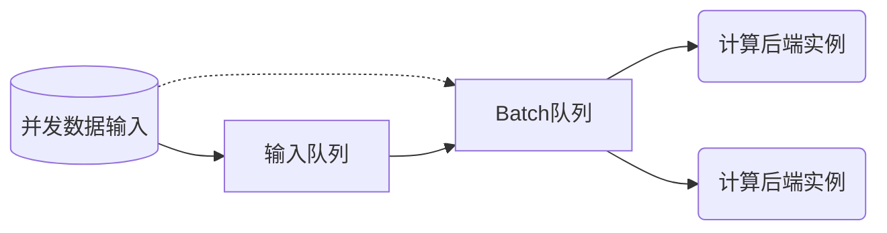

输入数据经由默认的单节点调度系统[`BaselineSchedule`](#baselineschedule)分发给计算后端执行。在此过程中主要经历了凑batch和多实例的调度。

## 凑batch/多实例
对于[`TensorrtTensor`](../backend-reference/torch#tensorrttensor)等模型推理引擎，输入范围一般是`[1, max_batch_size]`, 此时调度系统可将输入数据打包送入。`BaselineSchedule`单节点调度后端实现了如下的调度功能：
- 根据`instance_num`参数启动多个计算后端实例
- 从计算后端读取`max_batch_size=max()`, 如果大于1，启动凑batch功能
- 从**输入队列**获取数据，在`batching_timeout`的时间内，如果获得了`max_batch_size`个数据，那么将其送往**Batch队列**, 如果时间到了仍然没有获得足够数据，那么将已有数据送入**Batch队列**
- 将任务从**Batch队列**中分发到空闲的计算实例中。



以上是主干的大致流程，细节部分会有差别，如`BaselineSchedule`也实现了基础的自适应流量功能，根据多实例计算引擎的状态决定batch状态的功能，以及组合调度的功能。
## 单节点组合调度 {#single_node_combine}
有些计算后端的输入范围最小值大于1, 导致无法作为正常的后端进行调度（可能导致有些数据永远没有办法进行处理）。`BaselineSchedule`通过`&`符号提供了组合的能力。 

举例来讲，对于[`TensorrtTensor`](../backend-reference/torch#tensorrttensor)后端，一些模型不方便转为动态模型， 此时可以用一个 batchsize=1 的模型和几个 batchsize=N 的模拟动态batch.

```toml
[model]
model="batch1.onnx&batch4.onnx&batch8.onnx"
backend="SyncTensor[TensorrtTensor]" # or 'SyncTensor[TensorrtTensor]&SyncTensor[TensorrtTensor]'
instance_num = 2 # auto extend to '2&2&2'
min="1&4&8"
max="1&4&8"
```
此时，将共有6个实例，前两个实例输入范围均是`[1, 1]`，中间两个均是`[4, 4]`，最后两个均是`[8, 8]`。
对`BaselineSchedule`来说，这六个实例组成了两个虚拟实例，每个虚拟实例占用了三个实例，虚拟实例的输入范围是`[1, 8]`.

## `BaselineSchedule` 
### 初始化
|                  | 功能                          | 备注                                                                      |
|------------------|-----------------------------|-------------------------------------------------------------------------|
| batching_timeout | 凑batch超时时间，默认为0（毫秒） | 不接受`&`语法; 不需要凑batch时不生效                                      |
| instance_num     | 实例数目                      | instance_num与后端的max()的乘积一般设置为略小于需要的最大同时处理的数据量 |
| backend          | 真正的运算后端                | 通过min()/max()函数提供数据输入范围                                       |

在对`backend`实例初始化时，
```cpp
bool init(const std::unordered_map<std::string, std::string>& config, dict dict_config);
```
`BaselineSchedule`会生成初始化参数`dict_config`， 供它管理的后端实例共享数据；同时在`config`参数中额外写入`_independent_thread_index`, 取值范围为 `[0, instance_num - 1]`.


### 前向计算
:::note
调度后端被实现为线程安全的。
:::

### `min()/max()`
取值范围是[1, UINT32_MAX]

## 单节点调度系统的扩展
由于调度系统`BaselineSchedule`本身也是一个后端，用户可以实现不同的后端去替代他。
:::note
`BaselineSchedule`实际是以下后端的复合：<br />
`BaselineSchedule[Fusion[ContrastInstances[InstanceThread]]]`
:::
可参考`BaselineSchedule`的实现重新实现其细节。对于单节点系统，默认调用后端链为


在全局配置设置新的 `Interpreter::backend` 参数即可改变调度系统。

对于[多节点系统](../Inter-node/next.mdx)，默认调用后端链为

在全局或者某节点下设置新的 `PipelineV3::backend` 参数即可全局或者局部地改变调度系统。

## 小结
<!-- API of Extensible Backend -->


import Tabs from '@theme/Tabs';
import TabItem from '@theme/TabItem';