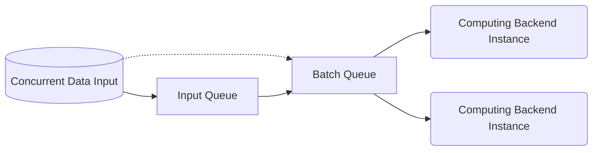

The input data is distributed to the computing back-end for execution via the default single node scheduling system [`BaselineSchedule`](#baselineschedule). During this process, it mainly undergoes batch gathering and multi-instance scheduling.

## Batch Gathering/Multi-Instance
For model inference engines such as [`TensorrtTensor`](../backend-reference/torch#tensorrttensor), the input range is generally `[1, max_batch_size]`, and the scheduling system can package the input data for delivery. The single node scheduling back-end `BaselineSchedule` implements the following scheduling features:
- Start multiple computing back-end instances based on the `instance_num` parameter.
- Read `max_batch_size=max()` from the computing back-end. If it is greater than 1, start the batch gathering function.
- Get data from the **input queue**. If `max_batch_size` data is obtained within `batching_timeout`, it will be sent to the **batch queue**. If enough data is not obtained within the time limit, the existing data will be sent to the **batch queue**.
- Distribute tasks from the **batch queue** to idle computing instances.



The above is the general process of the main branch, and there may be differences in the details. For example, `BaselineSchedule` also implements basic adaptive traffic functions, determines the batch status function based on the status of the multi-instance computing engine, and has composite scheduling functions.

## Single Node Composite Scheduling {#single_node_combine}
For some computing back-ends, the minimum input range is greater than 1, making it impossible to schedule as a normal back-end (which may result in some data never being processed). `BaselineSchedule` provides the ability to combine back-ends using the `&` symbol.

For example, for the [`TensorrtTensor`](../backend-reference/torch#tensorrttensor) back-end, some models are not easy to convert to dynamic models. In this case, a batchsize=1 model and several batchsize=N models can be used to simulate dynamic batching.


```toml
[model]
model="batch1.onnx&batch4.onnx&batch8.onnx"
backend="SyncTensor[TensorrtTensor]" # or 'SyncTensor[TensorrtTensor]&SyncTensor[TensorrtTensor]'
instance_num = 2 # auto extend to '2&2&2'
min="1&4&8"
max="1&4&8"
```

Under this scenario, there are a total of 6 instances, with the first two instances having an input range of `[1, 1]`, the middle two having an input range of `[4, 4]`, and the last two having an input range of `[8, 8]`. 

For `BaselineSchedule`, these six instances form two virtual instances, with each virtual instance occupying three instances. The input range of the virtual instance is `[1, 8]`.


## `BaselineSchedule`
### Initialization
|                  | Functionality                                     | Remarks                                                                                                                                         |
|------------------|---------------------------------------------------|-------------------------------------------------------------------------------------------------------------------------------------------------|
| batching_timeout | Timeout for batching, default 0 (in milliseconds) | Does not accept `&` syntax; ineffective when batching is not needed                                                                             |
| instance_num     | Number of instances                               | instance_num multiplied by the backend's max() is generally set to slightly less than the maximum amount of data to be processed simultaneously |
| backend          | Actual computation backend                        | Provides data input range through min()/max() functions                                                                                         |


When initializing a `backend` instance,

```cpp
bool init(const std::unordered_map<std::string, std::string>& config, dict dict_config);
```
`BaselineSchedule` generates an initialization parameter `dict_config` for the backend instances it manages to share data. Additionally, the `config` parameter includes an extra `_independent_thread_index` value, which ranges from `[0, instance_num - 1]`.


### Forward Calculation
:::note
The scheduling backend is implemented as thread-safe.
:::

### `min()/max()`
The value range is [1, UINT32_MAX].

## Extension of Single-Node Scheduling System
Since the scheduling system `BaselineSchedule` is itself a backend, users can implement different backends to replace it.
:::note
`BaselineSchedule` is actually a composite of the following backends:<br />
`BaselineSchedule[Fusion[ContrastInstances[InstanceThread]]]`
:::
Users can refer to the implementation of `BaselineSchedule` to re-implement its details.
For a single-node system, the default backend chain is as follows:


To change the scheduling system, simply set the new `Interpreter::backend` parameter in the global configuration.

For the [multi-node system](../Inter-node/next.mdx), the default backend chain called is:


To globally or locally change the scheduling system, set the new `PipelineV3::backend` parameter under the global or specific node.


import Tabs from '@theme/Tabs';
import TabItem from '@theme/TabItem';