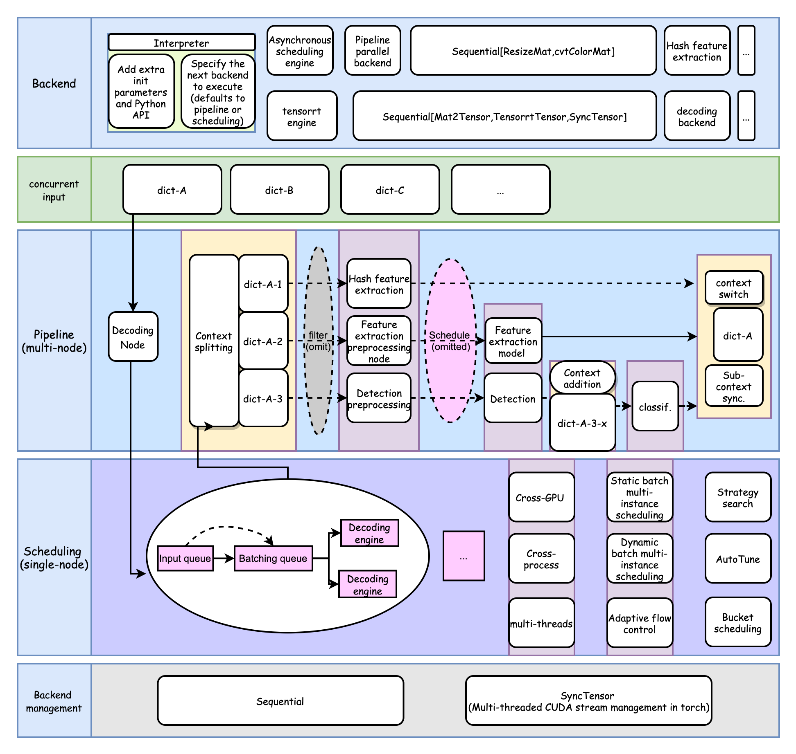

To enhance the peak throughput of deep learning serving, various challenges must be addressed. In real-world business scenarios, users usually require deploying end-to-end services comprising multiple nodes (such as model inference, general logic nodes, and remote calls) and delivering services to external clients via online serving. This necessitates support for the following functionalities:
- Multi-instance, dynamic batch processing, and bucketing on a single computing node
- Pipeline scheduling across multiple nodes
- Logical control flow between nodes

There are some industry practices, such as [triton inference server](https://github.com/triton-inference-server/server/blob/main/docs/user_guide/architecture.md#ensemble-models), [Alimama high_service(in chinese)](https://mp.weixin.qq.com/s/Fd2GNXqO3wl3FrA7Wli3jA), and [Meituan Vision GPU Inference Service Deployment Architecture Optimization Practice(in chinese)](https://zhuanlan.zhihu.com/p/605094862).

One common complaint from users of the Triton Inference Server is that in a system with multiple intertwined nodes, a lot of business logic needs to be completed on the client side and then called through RPC to the server, which can be cumbersome. For performance reasons, unconventional methods such as shared memory, ensemble, and [Business Logic Scripting(BLS)](https://github.com/triton-inference-server/python_backend#business-logic-scripting) must be considered.

To address these issues, TorchPipe provides a thread-safe function interface for the PyTorch frontend and a fine-grained backend extension for users, by delving into PyTorch's C++ calculation backend and CUDA stream management, as well as modeling domain-specific languages for multiple nodes.

TorchPipe framework diagram
 

**Features of the TorchPipe framework:**
- Achieves near-optimal performance (peak throughput/TP99) from a business perspective, reducing widespread negative optimization and performance loss between nodes.
- With a fine-grained generic backend, it is easy to expand hardware and weaken the difficulty of hardware vendor ecosystem migration.
- Simple and high-performance modeling, including complex business systems such as multi-model fusion. Typical industrial scenarios include AI systems with up to 10 model nodes in smart cities, and OCR systems that involve subgraph independent scheduling, bucket scheduling, and intelligent batch grouping for extreme optimization.
- Maximizes the elimination of performance loss caused by Python runtime, GIL, heterogeneous hardware, virtualization, and multi-process.

Unlike many other service-oriented frameworks, we decouple the system from RPC and focus on concurrent safety and pipeline scheduling of C++ and Python interfaces.

