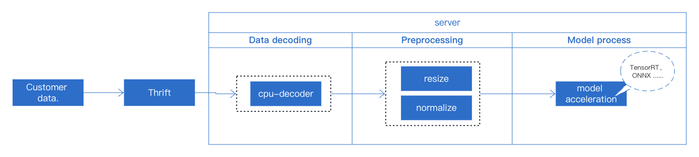
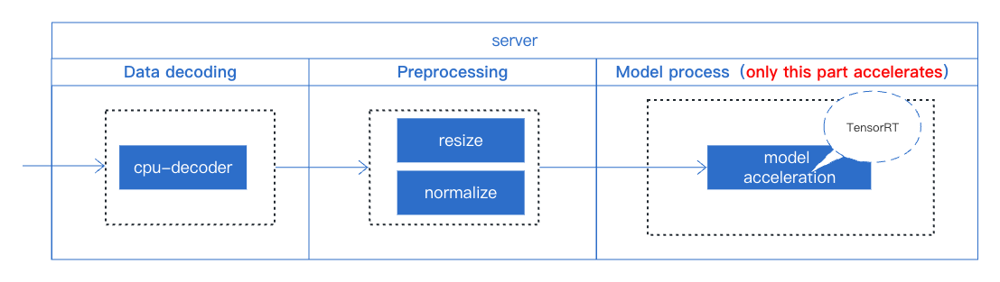
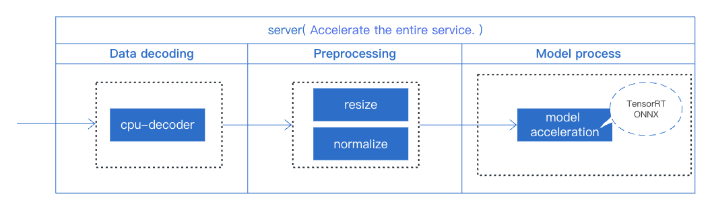
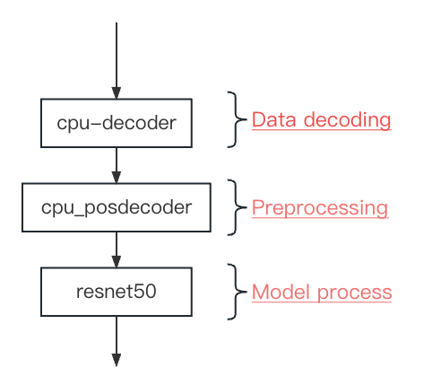

# Trial in 30mins(new users)

TorchPipe is a multi-instance pipeline parallel library that provides a seamless integration between lower-level acceleration libraries (such as TensorRT and OpenCV) and RPC frameworks. It guarantees high service throughput while meeting latency requirements. This document is mainly for new users, that is, users who are in the introductory stage of acceleration-related theoretical knowledge, know some python grammar, and can read simple codes. This content mainly includes the use of torchpipe for accelerating service deployment, complemented by performance and effect comparisons.

## Catalogue
* [1. Basic knowledge](#1)
* [2. Environmental installation and configuration](#2)
* [3. Acceleration Case - The service includes only a single model, using ResNet50 as an example.](#3)
    * [3.1 Using TensorRT Acceleration Scheme](#3.1)
    * [3.2 Using TorchPipe Acceleration Scheme](#3.2)
* [4. Performance and Effect Comparison](#4)

<a name='1'></a>

## 1.  Basic knowledge

The field of deep learning has seen rapid advancement in recent years with significant progress in areas such as image recognition, text recognition, and speech recognition. Currently, there are several model acceleration techniques that enhance the inference speed of deep learning models through computational and hardware optimization, and these have resulted in notable achievements in practical applications. These techniques include those based on TensorRT and TVM acceleration. This tutorial will use the simplest business case from actual business deployment to demonstrate how to use torchpipe for online service deployment. The entire service only includes a single ResNet50 model. The overall service flow process is as illustrated below.


We will briefly explain some concepts that need to be understood in model deployment. We hope to be helpful to you who are experiencing TorchPipe for the first time. For details, please refer to [Preliminary Knowledge](./preliminaries).


<a name='2'></a>

## 2.   Environmental installation and configuration

For specific installation steps, please refer to [installation](installation.mdx). We provide two methods for configuring the TorchPipe environment:
 - [Using NGC base image.](installation.mdx#NGC)
 - [Customizing Dockerfile](installation.mdx#selfdocker)


<a name='3'></a>

## 3. Acceleration Case: Advancing from TensorRT to torchpipe.

This section begin by discussing the application of the TensorRT acceleration solution,and provide  a general acceleration strategy for service deployment.Then, leveraging this solution, we will employ torchpipe to further optimize the acceleration across the entire service.
<a name='3.1'></a>

### 3.1 Using TensorRT Acceleration Scheme {#UTAS}




TensorRT is an SDK that facilitates high-performance machine learning inference. It focuses specifically on running an already-trained network quickly and efficiently on NVIDIA hardware. However, TensorRT only supports optimization and acceleration for a model. Therefore, during the deployment of this service, we still use conventional operations for data decoding and preprocessing, both of which are done in Python. The model acceleration is achieved by using TensorRT to build the engine.

The details of each part are as follows:

1、Data decoding
This part primarily relies on CPU data decoding to execute the operation.

```py
## Data decoding（CPU decoding）
img = cv2.imdecode(img, flags=cv2.IMREAD_COLOR)
```

2、Preprocessing
In this part, we mainly uses the built-in functions of pytorch to complete the operation

```py
## Preprocessing
precls_trans = transforms.Compose([transforms.ToTensor(), transforms.Normalize([0.485, 0.456, 0.406],[0.229, 0.224, 0.225]), ])

img = precls_trans(cv2.resize(cv2.cvtColor(img, cv2.COLOR_BGR2RGB), (224,224)))
```

3、TensorRT acceleration

```py
def load_classifier(net, max_batch_size,fp16):
    x = torch.ones((1, 3, 224, 224))
    if device == 'gpu':
        x = x.cuda()
        net.cuda()
    net.eval()
    trtmodel = torch2trt(net,
                        [x], 
                        fp16_mode = fp16,
                        max_batch_size=max_batch_size,
                        max_workspace_size=32 * max_batch_size) 
    del x
    del net
    return trtmodel

```

The overall online service deployment can be found at [main_trt.py](https://g.hz.netease.com/deploy/torchpipe/-/blob/develop/examples/resnet50/main_trt.py)

:::tip
Since TensorRT is not thread-safe, when using this method for model acceleration, it is necessary to handle locking (with self.lock:) during the service deployment process.
:::


<a name='3.2'></a>

### 3.2 Using TorchPipe Acceleration Scheme

From the above process, it's clear that when accelerating a single model, the focus is primarily on the acceleration of the model itself, while other factors in the service, such as data decoding and preprocessing operations, are overlooked. These preprocessing steps can impact the service's throughput and latency. Therefore, to achieve optimal throughput and latency, we use TorchPipe to optimize the entire service. The specific steps include:

- Multi-instance, dynamic batch processing, and bucketing on a single computing node
- Pipeline scheduling across multiple nodes
- Logical control flow between nodes



We've made adjustments to the deployment of our service using TorchPipe.The overall online service deployment can be found at [main_torchpipe.py](https://g.hz.netease.com/deploy/torchpipe/-/blob/develop/examples/resnet50/main_torchpipe.py).
The core function modifications as follows:

```py
# ------- main -------
num_images = len(requests)
for i in range(num_images):
    bin_data_list.append({TASK_DATA_KEY:requests[i].data, "node_name":"cpu_decoder"})
    
    
toml_path = "resnet50.toml"
classifier = pipe(toml_path)
classifier(bin_data_list)
 
 
if TASK_RESULT_KEY not in bin_data.keys():
    print("error decode")
    return results
else:
    dis = self.softmax(bin_data[TASK_RESULT_KEY])

```
From the above, we see a reduction in code volume compared to the original main function. The key lies within the contents of the toml file, which includes three nodes: [cpu_decoder], [cpu_posdecoder], and [resnet50]. These nodes operate in sequence, corresponding to the three parts mentioned in [section 3.1](quick_start_new_user.md#UTAS), as shown below:



The contents of the toml file are as follows:

```bash
# Schedule'parameter
batching_timeout = 5 
instance_num = 8 
precision = "fp16" 

## Data decoding
#
#      This corresponds to 3.1（1).data decoding
#           img = cv2.imdecode(img, flags=cv2.IMREAD_COLOR)
#      Note:
#           The original decoding output format was BGR
#           The DecodeMat backend also defaults to outputting in BGR format
#           Since decoding is done on the CPU, DecodeMat is used
#           After each node is completed, the name of the next node needs to be 
#           appended, otherwise the last node is assumed by default
#
[cpu_decoder]
backend = "DecodeMat" 
next = "cpu_posprocess"

## preprocessing: resize、cvtColorMat
#
#      This corresponds to 3.1（2) preprocessing
#           precls_trans = transforms.Compose([transforms.ToTensor(), ])
#           img = precls_trans(cv2.resize(cv2.cvtColor(img, cv2.COLOR_BGR2RGB), (224,224)))
#      Note:
#          The original preprocessing order was resize, cv2.COLOR_BGR2RGB,
#          then Normalize.
#          However, the normalization step is now integrated into the model 
#          processing (the [resnet50] node), so the output result after the 
#          preprocessing in this node is consistent with the preprocessing result 
#          without normalization.
#          After each node is completed, the name of the next node needs to be 
#          appended, otherwise the last node is assumed by default.
#
[cpu_posdecoder]
backend = "SyncTensor[Sequential[ResizeMat,cvtColorMat,Mat2Tensor]]"

### Parameters for the resize operation
resize_h = 224
resize_w = 224

### Parameters for the cvtColorMat operation:
color = "rgb"

next = "resnet50"

##  preprocessing-normalize and model acceleration
#
#          This corresponds to 3.1（3) TensorRT acceleration and 3.1（2）Normalize
#      Note:
#          There's a slight difference from the original method of generating 
#          engines online. Here, the model needs to be first converted to ONNX 
#          format.
# 
#          For the conversion method, see [Converting Torch to ONNX].
#
[resnet50]
backend = "Torch[TensorrtTensor]" 
min = 1
max = 4
instance_num = 4
model = "/you/model/path/resnet50.onnx" 

mean="123.675, 116.28, 103.53" # 255*"0.485, 0.456, 0.406"
std="58.395, 57.120, 57.375" # 255*"0.229, 0.224, 0.225"

# TensorrtTensor 
"model::cache"="/you/model/path/resnet50.trt" # or resnet50.trt.encrypted

```


:::tip
- For the specific usage and functionality of other backend operators, please refer to [Basic Backend](./backend-reference/basic), [OpenCV Backend](./backend-reference/opencv), [Torch Backend](./backend-reference/torch), and [Log](./backend-reference/log).
- This deviates slightly from the original method of generating engines online, as the model needs to be first converted to ONNX format. For the conversion method, see [Converting Torch to ONNX](faq/onnx.mdx).
- TorchPipe has resolved the issue of TensorRT objects not being thread-safe and has undergone extensive experimental testing. Therefore, the lock can be disabled during service operation, i.e., the line `with self.lock:` can be commented out (in [section 3.1]).
:::


<a name='4'></a>

## 4 Performance and Effect Comparison
`python clien_qps.py --img_dir /your/testimg/path/ --port 8888 --request_client 20 --request_batch 1
`

The specific test code can be found at [client_qps.py](https://g.hz.netease.com/deploy/torchpipe/-/blob/develop/examples/resnet50/client_qps.py)

With the same Thrift service interface, testing on a machine with NIDIA-3080 GPU, 8-core CPU, and concurrency of 10, we have the following results:

- throughput:

| Methods | QPS |
|:-: | :-: |
| Pure TensorRT | 747.92 |
| Using TorchPipe |2172.54|

- response time:

| Methods | TP50 | TP99 |
:-: | :-: | :-:| 
| Pure TensorRT | 26.74 |35.24|
| Using TorchPipe |8.89|14.28|

- resource utilization:

| Methods | GPU Utilization | CPU Utilization | Memory Utilization |
:-: | :-: | :-:| :-: |
| Pure TensorRT | 42-45% |1473%|3.8%|
| Using TorchPipe |48-50% |983.8%|1.6%|

