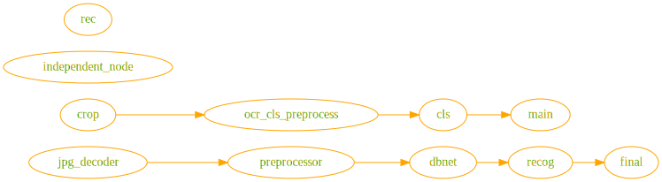

 

|           Name           | [Image](../tools/vis.mdx)              | Elements                                                                                                  | Note |
|:------------------------:|----------------------------------------|-----------------------------------------------------------------------------------------------------------|------|
|        [resnet18]        |  | [TensorrtTensor](../backend-reference/torch.mdx#tensorrttensor) [filter] [torchpipe.utils.test] |      |
| [YoloV8-pipeline](https://github.com/torchpipe/torchpipe/tree/develop/examples/pipeline) |                                        |                                            |      |
|         [yolox]          |                | [TensorrtTensor](../backend-reference/torch.mdx#tensorrttensor) [torchpipe.utils.cpp_extension.load] |      |
|        [PP-OCRv2]        |                | [MapReduce](../Inter-node/graphtraversal.mdx#mapreduce) [Jump]                                       |      |
| [tensorrt's native int8] |                                        | [TensorrtTensor](../backend-reference/torch.mdx#tensorrttensor)                                           |      |

[resnet18]: https://github.com/torchpipe/torchpipe/tree/v0/examples/resnet18
[yolox]: https://github.com/torchpipe/torchpipe/tree/v0/examples/yolox
[PP-OCRv2]: https://github.com/torchpipe/torchpipe/tree/v0/examples/ppocr
[TensorRT's native INT8]: https://github.com/torchpipe/torchpipe/tree/v0/examples/int8

[torchpipe.utils.cpp_extension.load]: ../python/compile.mdx
[filter]: ../Inter-node/filter.mdx
[torchpipe.utils.test]: ../python/test.mdx
[Jump]: ../Inter-node/graphtraversal.mdx#jump

🙏 Feel free to add your use case here.