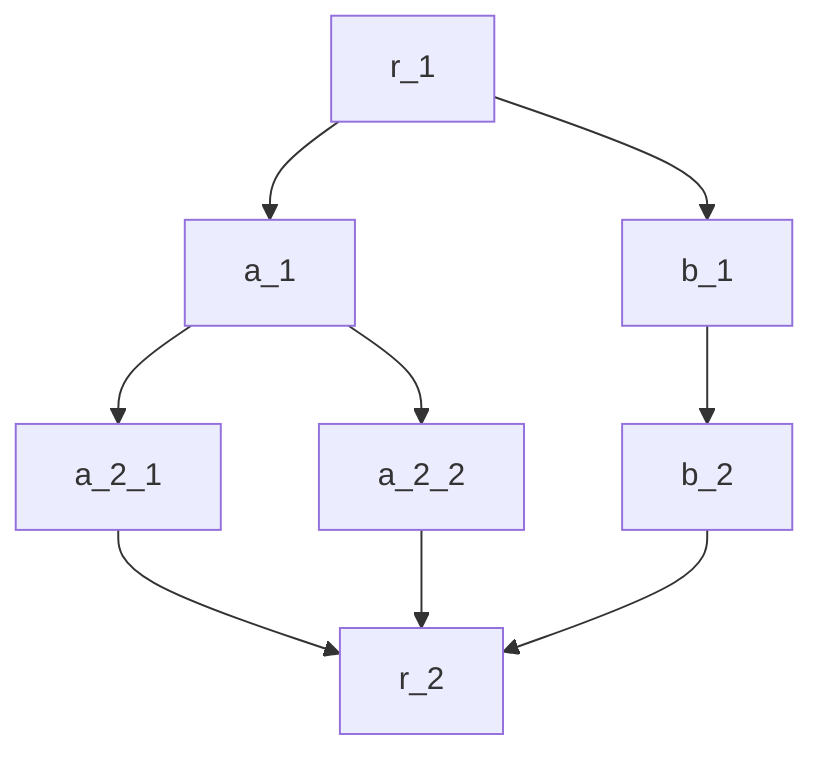

在上节的多分支示例中，两个分支都可能被跳过。为了记录每个分支的状态，以及将结果都汇总到最终的结果，需要很多的键值和复杂的map配置。

在实际业务中，我们发现这样会很麻烦。 本节介绍一种共享上下文的最佳实践。


## 自定义全局共享结构体



在r_1中定义一个可以记录所有分支结果的结构体, 写入数据的"context"键值中：
```cpp
struct OurStruct{
    bool a_skiped = false;
    bool b_skiped = false;
    std::vector<float> a_result;
    at::Tensor b_result;
}

(*input)["context"] = std::make_shared<OurStruct>(); //input is a dict

```

在每个分支中，只处理自己那部分的数据。这样，我们仅需要一个键值"context"就可以容纳所有数据。
:::caution 数据竞争
除非只读，多分支禁止访问同一个context相同部分。
:::

## map中的context语法糖


上图中，如果b_2没有配置map，那么它将与b_1共享同一个数据(dict)。如果a_2_1没有配置map，它将获得a_1数据的拷贝。只要没有配置map，节点总能访问到context. 然而当使用了map时，会新创建一个全新的dict并将指定键值复制过来，此时不一定会含有context项。

:::info 语法糖
对于map配置，如果数据源中有context属性，而map没有配置context的映射，那么map将自动添加context的映射。
:::

