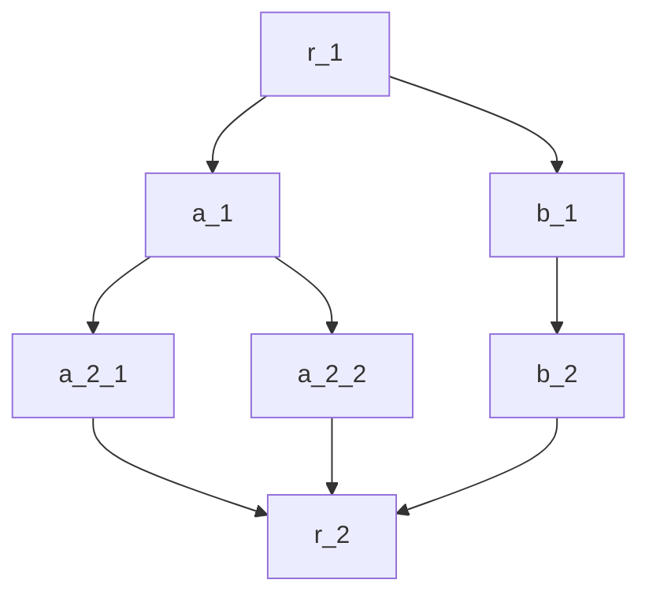

正如在Sequential引入[filter](../Intra-node/Sequential.mdx#filter_sequential)时介绍过的，filter是节点或者后端间的逻辑控制指令，拥有以下状态：
Run, Skip, SerialSkip, SubGraphSkip, Break, Error.

## 默认多节点调度器对filter返回值的解析

在多节点调度中，filter返回值分别代表：
- Run, 代表可以执行当前节点的后端
- Skip, 代表跳过当前节点的后端，但是不代表这个节点没有结果。节点的结果就是被filter处理过的`dict`
- Break, 代表跳出整个有向无环图的执行， 被filter处理过的`dict`就是最终结果
- Error, 代表出现错误
- SerialSkip, 代表可以跳过最大串行子图
- SubGraphSkip,  代表可以跳过最大独立子图。

考虑如下的有向无环图



某些场景下，我们想直接跳过左边的分支（a_1分支）或者右边的分支（b_1分支）。

如果a_1的filter返回SubGraphSkip时, 将跳过以a_1为根节点的最大独立子图（a_1, a_2_1, a_2_2）。
如果b_1的filter返回SerialSkip时, 将跳过以b_1为根节点的最大串行子图（b_1, b_2）。

独立指的是：
- 子图中的非根节点的前序节点都包含在子图中。

"跳过"包含两层含义：
- 将子图根节点的next更改为子图叶子节点的next的并集
- 将对子图非根节点的引用转发到根节点，也就是整个子图折叠到子图根节点这一个点。

:::info 子图的折叠
当子图被折叠时，子图中的非根节点被隐藏。此时后续节点通过map寻求从他们获取数据，将自动变更为从子图根节点获取数据。
:::

## 自定义filter

我们可以自定义filter. 比如:

```cpp
#include "filter.hpp"

class your_filter : public Filter {
 public:
  status forward(dict data) override { 
    // handle data
    if (...)
    // highlight-next-line
        return status::SubGraphSkip;
    else
        return status::Run;     
    }
};
IPIPE_REGISTER(Filter, your_filter, "your_filter");
```

通过[AOT编译](../Intra-node/extensible_backend.mdx#compile)即可使用自定义的filter. 

```toml
[a_1]
filter="your_filter"
```

注意自定义filter请勿与内置filter重名。
## 内置filter {#default_filters}
|                                                                                                                                                     | 功能                             |   |
|-----------------------------------------------------------------------------------------------------------------------------------------------------|--------------------------------|---|
| Run/run <br />Skip/skip <br />SerialSkip/serial_skip/serialskip <br />SubGraphSkip/subgraph_skip/subgraphskip, <br />Break/break, <br />Error/error | 无条件返回对应状态值             |   |
| swap                                                                                                                                                | 没有result返回Break, 否则返回Run |   |
| or                                                                                                                                                  | 没有result返回Run, 否则返回Skip  |   |


 