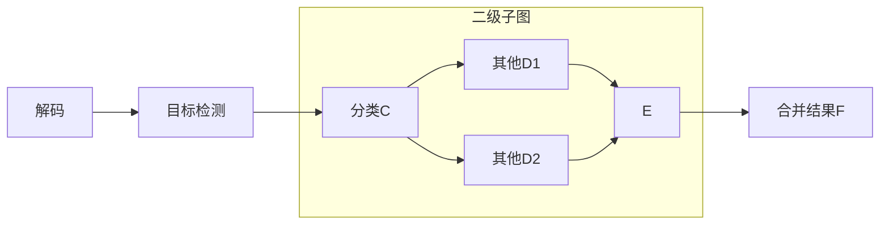
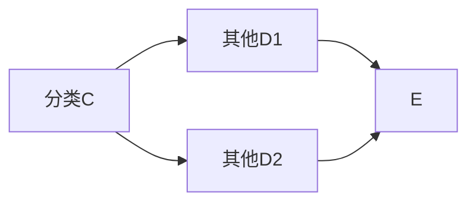
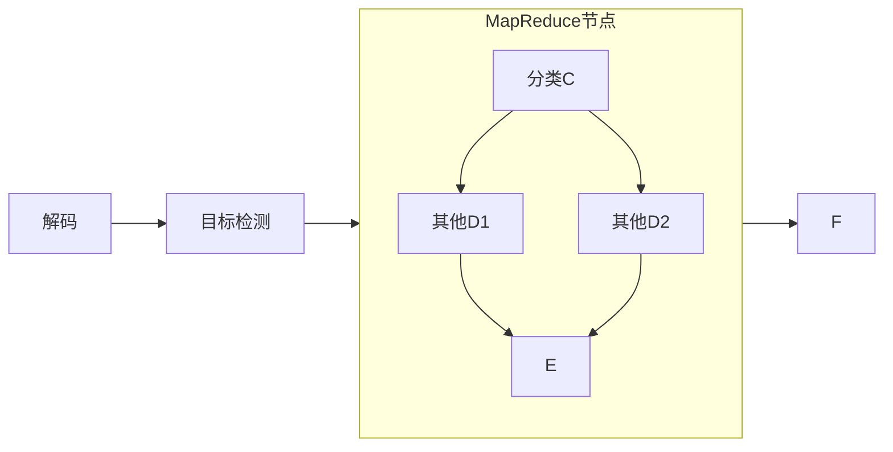
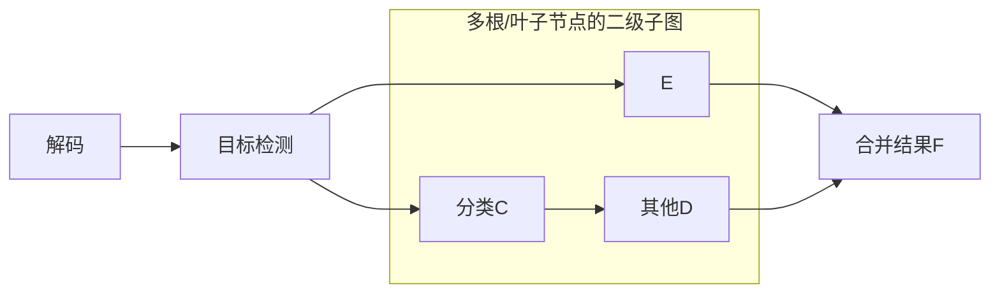

## 多级结构化
考虑在计算机视觉中的如下任务：



乍看之下似乎它形成了完整的有向无环图，然而实际中存在如下问题：
- A. 目标检测产生了多个子目标（子上下文）进入了CDE，多个子目标又在F中发生了合并
- B. 子目标在CDE中应该是相互独立的，不应该相互等待跑完某个节点再去跑下一个节点

关于A，我们认为是上下文发生了变化；子上下文流经了CED构成的独立的图。关于B，我们认为同级别的多个上下文在节点上不一定需要进行同步。

CDE形成了事实上的子图，然而我们发现很难用子图的视角进行通用的设计。本质上我们要处理一个以有向无环图为节点的有向无环图，并且可以是递归的。

我们需要用户将图拆为多个部分，进行图间跳转。

## 图的拆分
原始图可以拆成两部分。
主干：


其中[MapReduce](#mapreduce)是一个功能性的后端，它将数据分裂为子上下文，送入以下图：


然后将E中的多个子上下文合并起来。

整体如下所示，跳转目标被当作了一个节点：




## Jump
跳转到另外一个节点（需要是根节点）

:::caution 上下文切换
对于不连通的两个图，多节点调度系统不共享节点的数据上下文。
:::

### 初始化

|        | 说明                                        | 备注 |
|--------|-------------------------------------------|------|
| `jump` | 需要跳转到的目标图的根节点节点名；只能有一个 |      |


### min()/max()
[1, UINT32_MAX]

## MapReduce
MapReduce是Jump的子类，重新实现了split和merge操作。
MapReduce将`一个`输入数据拆分为`多个`（split操作）, 跳转到其他图后进行计算，待所有计算完成后，将`多个`数据合并为`一个`(merge操作)。 
### 初始化

|         | 说明                                  | 备注                                         |
|---------|-------------------------------------|--------------------------------------------|
| `split` | 待分裂的键值，多个以逗号分开           | 默认值: "data", 为空时把自身作为分裂后的对象 |
| `merge` | 待合并的键值，多个以逗号分开           | 默认值: "result"，不能为空                    |
| `jump`  | 需要跳转到的目标图的根节点；只能有一个 | 继承自基类Jump                               |


### 前向计算
#### map
拷贝输入数据`dict`，将`split键值`对应的数据进行拆分。要求原始数据中split键值对应的数据类型是`std::vector<T>`.
#### reduce
根据`merge`参数进行结果合并，合并后的类型是`std::vector<any>`

:::caution
如果一个子任务失败（结果中没有`result`）,那么以这种方式进行合并`result`时，将抛出异常，导致相关联的子任务都异常。一般来说，这种行为是可以接受的；但是如果需要允许子任务无`result`时，不影响关联子任务，可以考虑如下措施：
- 自定义后端重新实现`merge`操作。
- 使用context语法糖（MapReduce不会在执行split/merge时自动拷贝context）
:::

### min()/max()
[1, UINT32_MAX]

## split和merge自定义扩展

默认的split和merge操作不一定能满足要求，我们可继承Jump进行自定义扩展：

```cpp
#include "Jump.hpp"

class YourMapReduce : public ipipe::Jump{

  virtual std::vector<dict> split(dict data) override{
    // highlight-next-line
    return {data}; // <== Revise this implementation.
  }
  virtual dict merge(const std::vector<dict>& data) override{
    // highlight-next-line
    return data[0];// <== Revise this implementation.
  }

  // 如果有自定义初始化参数需要接收，实现以下函数：
  virtual bool post_init(const std::unordered_map<std::string, std::string>& config,
                         dict dict_config) override{
    return true;
  }
};
```
## 限制
目前跳转到多个节点是不支持的，多个节点合并也是不支持的，也就是目标图的根节点和叶子节点数量都需要是1.

以下图如果用户不增加中间节点，是没法处理的。


 