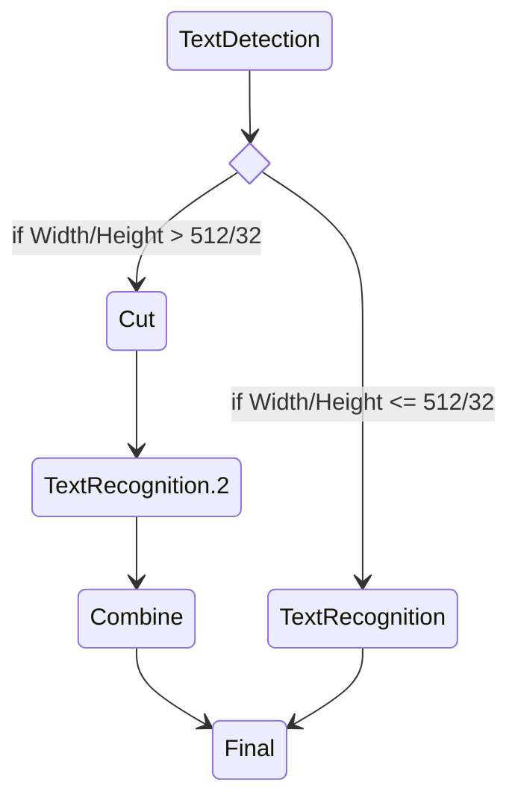

在一些场景中，有时需要在不同分支或者不同逻辑控制流条件下进入某些节点，但不希望共享其后端。



在上图的文本识别案例中，我们希望TextRecognition和TextRecognition.2节点共享相同的后端实例。以**点+别名**的形式，用户可以定义物理节点的逻辑节点。逻辑节点可以单独设置与它原有的物理节点不同的逻辑配置(next/filter/map)。

## 示例

```toml
[in]
next="rec,rec.2"
[rec]
# default backend is Identity, which set 'result' = 'data'
next="final"
[rec.2]
next="final"
# this backend is not activated
# highlight-next-line
backend="C10Exception"
[final]
map="rec[result:data],rec.2[result:data.2]"
```

不难测试发现：
```python
model  = torchpipe.pipe("assets/toml/logical.toml")

inputs = {"data":1}
model(inputs)
assert(inputs["result"]==inputs["data.2"])
```