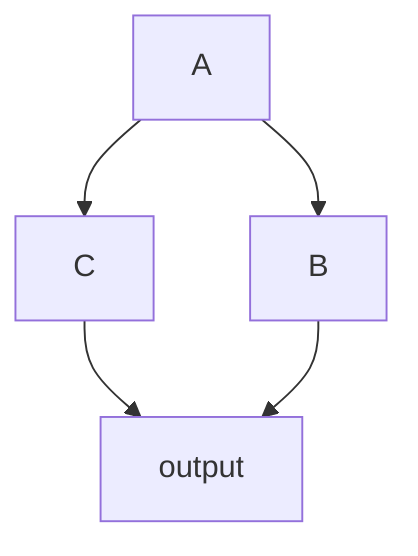

采用`Sequential`的方式串行起多个后端面临着一些问题：
- 输入范围切换时，范围较小的后端无法完全并行执行
- 后端所需的硬件资源变化时，硬件资源不能被充分被利用

`PipelineV3`作为默认的流水线调度后端，处理了以上问题并满足两个额外的需求：
- 后端与后端之间灵活的数据键值的变化
- 更复杂的有向无环图的支持

在本节中，主要介绍多个节点如何链接为一个有向无环图。

## 串行节点
在上一章节中遇到的[`Sequential`](../Intra-node/Sequential.mdx)`[DecodeMat,ResizeMat]`后端，用多节点的方式表示为：
```toml
# irrelevant parameters are ignored 
[decode]
# highlight-next-line
next="resize"

[resize]
```

`decode->resize`组成了由两个节点构成的有向无环图，其中decode是根节点，resize是子节点。

与Sequential类似，根节点默认[filter](../Intra-node/Sequential.mdx#filter_sequential)=`Continue`, 子节点默认filter=`swap`.

:::info 数据流向
原始输入`dict`数据进入节点`decode`后，它的`result`键值被写入了结果。
通过resize节点的filter `swap`时，结果被置换到了`data`键值中；随后此`dict`进入了resize节点，并在resize节点的后端中被写入`result`键值。
:::

## 多分支

如果一个节点有多个后续节点，可在`next`中通过逗号分开。

考虑如下多节点系统


 
节点关系可表示为

```toml
# irrelevant parameters are ignored 
[A]
# highlight-next-line
next="B,C"
[B]
next="output"
[C]
next="output"
[output]
```

:::info 数据流向
原始输入`dict`数据被节点A处理后，B和C都将向A节点请求数据。为了避免访问到被改变的数据，B和C都会从`A`拷贝一份数据副本。
:::

## map: 从前序节点收集数据 {#map}

```toml
# irrelevant parameters are ignored 
[output]
# highlight-next-line
map="B[result:B_result],C[result:data]"
```

output通过`map`配置将B节点的result映射到了自己的B_result， 将C节点的result映射到了data. 当map存在时，默认filter为`Continue/run`, 也就是不再对输入数据做任何处理。

`map`亦可将前序节点的多个键值映射到自身，如 `map="B[1:0,1:1,2:data]"`

如果不产生歧义，map可省略节点名：`map=“[result:data]”`。

:::note
- 组合出来的数据必须包含`data`. 
- `map`与`next`一样，都对源节点产生了引用，如果某个节点被两个或两个以上后续节点引用，那么在后续节点向该节点请求数据时，需要拷贝其数据。
    ```mermaid
    flowchart LR
        A --> B
        B --> C
        C -->|"map=B[result:data],C[result:box]"| D
    ```
    如上图，B节点被C节点通过next引用，被D节点通过map引用。C节点在向B节点请求数据时，会拷贝B节点的数据，避免对B节点的数据进行的更改影响到D节点。
- 通过map请求数据时，一定会拷贝源数据。
:::

:::warning 冗余连接
- torchpipe支持的图仅仅指示了节点间的计算顺序。如下所示，`B --> D` 的连接在此意义下是冗余的，不推荐添加此连接，容易造成混乱。 在未来版本中冗余连接将被禁止。

    ```mermaid
    flowchart LR
        A --> B
        B --> C
        B --> D
        C --> D
    ```
    
:::

:::info 数据流向
`output`节点有两个前序节点`B, C`，它通过map，生成一份新的数据拷贝；最终，将自己的数据再更新到原始输入`dict`数据中。
:::
## 小结
 