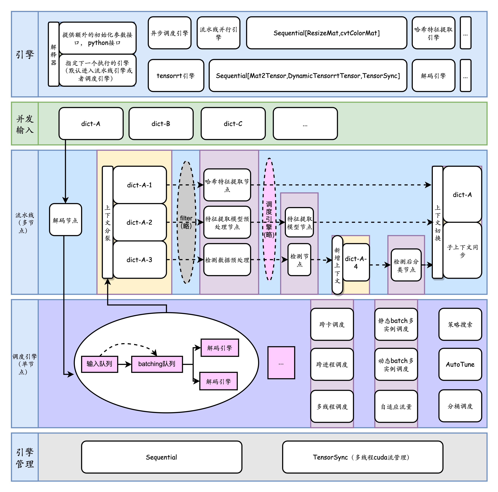

提升深度学习Serving的峰值吞吐面临多个难题。在实际业务应用中，用户通常需要部署包含多个节点（如模型推理，普通逻辑节点和远程调用）的端到端业务，并以在线Serving的形式对外提供服务。这需要支持以下功能：
- 针对单个计算节点的多实例、动态批处理和分桶
- 针对多个节点的流水线调度，
- 节点间的逻辑控制流

业界有一些实践，如[triton inference server](https://github.com/triton-inference-server/server/blob/main/docs/user_guide/architecture.md#ensemble-models), [阿里妈妈high_service](https://mp.weixin.qq.com/s/Fd2GNXqO3wl3FrA7Wli3jA), [美团视觉GPU推理服务部署架构优化实践](https://zhuanlan.zhihu.com/p/605094862)。

通常用户对于Trinton Inference Server的一个抱怨是，在多个节点交织的系统中，需要在客户端完成大量业务逻辑，并通过RPC调用服务端，很麻烦；而为了性能考虑，不得不考虑共享显存、ensemble、[BLS](https://github.com/triton-inference-server/python_backend#business-logic-scripting)等非常规手段。

为了解决这个问题，TorchPipe通过深入PyTorch的C++计算后端和CUDA流管理，以及针对多节点的领域特定语言建模，对外提供面向PyTorch前端的线程安全函数接口，对内提供面向用户的细粒度后端扩展。

torchpipe框架图
 

**torchpipe框架特点：**：
 - 性能（峰值吞吐/TP99）上达到业务角度上的近乎最优，减少广泛存在的负优化和节点间性能损耗。
 - 凭借细粒度泛型后端，便于硬件扩展，弱化硬件厂商生态迁移难度。
 - 简单而高性能的建模包括多模型融合在内的一些过于复杂的业务系统。工业界典型场景有智慧城市中多达10个模型节点的AI系统，以及如果要极限优化，会涉及到子图独立调度、分桶调度、智能化组batch的OCR系统。
 - 最大限度摆脱 Python 运行时、GIL、异构硬件、虚拟化和多进程带来的性能损耗。

与许多其他服务化框架不同，我们将系统与RPC进行解耦，关注于 C++ 和 Python 接口的并发安全和流水线调度。

