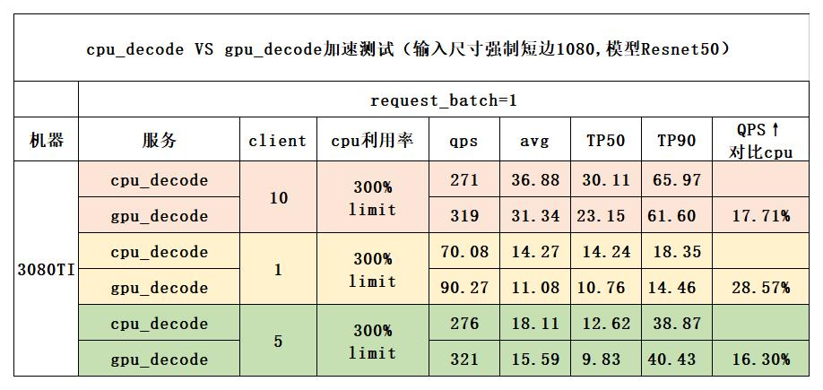

:::caution
这部分功能迭代中。
:::

为了对齐部署和训练的前处理过程，很自然的想法是将torchpipe加入训练流程流水线。然而这并不是容易的，主要是因为这将涉及到多卡数据的问题。事实上，目前鲜有将torchvision的gpu前处理加入训练流水线的实践。一个可供参考的例子是[kornia的training API](https://kornia.readthedocs.io/en/latest/get-started/training.html).然而它是非常重的，重构了整个流程。


###  Motivation

   * 在项目的train-infer迭代中，通常的做法是在训练环节使用Open-CV模块在CPU上进行数据预处理；而在上线环节中，希望使用GPU进行该操作以进一步提升上线服务性能.

      * 关于本项目带来的服务性能提升测试，可以参考下面的性能提升实验（QPS、RT等指标受实际线上环境、数据影响较大，仅供参考）
          


   * 基于CPU的数据预处理与GPU不对齐，可能会导致模型的识别效果出现波动，因而限制了infer时GPU解码的应用。

     * 关于train-infer不对齐带来的负面影响和本项目带来的改进，可以参考下面的效果一致性测试实验,效果结论可以看表中注释部分
      
     
    
   * 本项目希望在Pytorch训练框架中基于Torchpipe加速框架实现GPU预处理，同时利用Torchpipe的多实例操作，有效提高训练效率。


### Major features
* 将Torchpipe框架作为GPU预处理pipeline嵌入通用的Pytorch训练框架中，实现便捷式使用
* Train-Infer的gpu解码对齐，进一步提升上线服务性能（并发、耗时等）
* 利用线程池、缓存队列、多卡分发数据等技术，实现了多进程Dataloader & GPU负载均衡 & 高效训练
* 支持DP & DDP等多种分布式训练模式
* 同时支持cpu与gpu解码，可通过参数控制比例，变相增加augment操作


### Quick Usage

本样例中，提供了学习参考代码，在torchpipe的example/gpu_train 文件夹下，分别为train_gpu.py，train_dp.py, train_ddp.py。

  
- train_dp.py 如果多卡并行使用了dp，可以参考这份代码。
  ```
  sh train_dp.sh
  ```
- train_ddp.py 如果多卡并行使用了ddp，可以参考这份代码。
  ```
  sh train_ddp.sh
  ```


**为了方便大家调用，只需8步，就可以将该方法应用到您的项目中去。**

##### step 1: 准备toml

- toml主要用于设置gpu decode、resize等操作。
- 可以参考例子中的toml文件夹下的gpu_decode_train.toml以及gpu_decode_val.toml，分别用于train和val的数据加载以及预处理过程，
- 如有必要，可以在其中修改对应的操作。

##### step 2: import library

```python
from wrap_loader_torchpipe import cv2_loader, DataLoader , TensorToTensor
```

 ##### step 3: dataset not need augment, and change loader to cv2_loader

```python
train_dataset = datasets.ImageFolder(traindir, loader=cv2_loader)

```

##### step 4: 设置 gpu augment , 这里不需要resize操作，resize在torchpipe的toml里面设置了，只设置其他的就行，唯一不同的是 [ToTensor] 变成了自定义的 [TensorToTensor]

```python

train_transform_gpu = transforms.Compose([       
    transforms.RandomCrop(224),
    transforms.RandomHorizontalFlip(0.05),
    transforms.RandomGrayscale(0.02),
    transforms.RandomRotation(10),
    transforms.ColorJitter(0.05, 0.05, 0.05),  ## 4个参数这里设置3个，是因为最后的hue参数在1080Ti计算会导致速度变慢，其他显卡不会有问题
    TensorToTensor(),
    #the same as normalize range [0,1]
    transforms.Normalize([0.485, 0.456, 0.406], [0.229, 0.224, 0.225])
])

```

##### step 5: 如果要做gpu与cpu的联合预处理，需要同时设置 cpu augment, 这个就是正常按照pytorch原来的就行。

```python

train_transform_cpu =transforms.Compose([
        cv2Resize((args.image_size, args.image_size)),
        transforms.ToPILImage(),
        transforms.RandomHorizontalFlip(0.05),
        transforms.RandomGrayscale(0.02),
        transforms.RandomRotation(5),
        transforms.ColorJitter(0.05, 0.05, 0.05, 0.05),
        transforms.ToTensor(),
        transforms.Normalize([0.485, 0.456, 0.406], [0.229, 0.224, 0.225])
])

```

##### step 6: 将dataloader类进行包装，包装成我们的wrap_dataloader_torchpipe类。

* 需要注意的是，这里需要传入toml的路径
* local_rank为使用ddp的时候才会用到的参数，不使用ddp，不设置这个参数即可。
* cpu_percentage 代表的是cpu解码以及预处理的百分比。

```python
  
wrap_train_loader = wrap_dataloader_torchpipe( 
        parallel_type = 'ddp',
        dataloader = train_loader , 
        toml_path = './toml/gpu_decode_train.toml' , 
        local_rank = local_rank ,
        transforms_gpu = train_transform_gpu ,
        transforms_cpu = train_transform_cpu , 
        cpu_percentage = 0.3
)
```

##### step 7: 将val做跟train同样的操作。

##### step 8: 每个epoch需要重置一下迭代器

```python

wrap_train_loader.reset()
wrap_val_loader.reset()
 ```


### 训练好的模型如何进行本地测试?

训练和测试密不可分，前面我们已经实现了利用torchpipe实现gpu解码，并将模型训练完成，那么如何利用训练好的模型来进行gpu解码测试呢？

这里主要涉及两个问题：
1. 在测试阶段如何实现gpu解码与预处理。
2. 模型如何进行前向。

这里给出两种解决方案，供大家参考，可根据项目实际情况来选择具体方案。

详细代码可以参考example里面的test_gpu.py，以及test_gpu.sh，大家可以先看下面的介绍，然后再看详细代码，就一目了然了。

#### 方案一（推荐）：解码和模型全部使用torchpipe来完成

这个方案适合项目相对简单（比如只有1、2个模型），或者对torchpipe具有一定掌握，可以利用torchpipe实现复杂逻辑的同学

##### step 1: 将pytorch模型转换为onnx模型，这里可以参考文档：[pytorch模型转onnx](torchpipe.github.io/docs/faq/onnx?_highlight=onnx)

* 这一步需要注意的是：要不要将**减均值、除方差**放到模型中，这里做了，后面就不需要这个预处理了。

##### step 2: 实现toml

这里给一个简单的通用版本：

* 这个版本实现了解码与模型前向的基本操作，先对图像进行解码、resize、cvtcolor，然后过模型，给出结果。

```python
batching_timeout = 1 
instance_num =1

[jpg_decoder]
backend = "SyncTensor[ Sequential[DecodeTensor,ResizeTensor,cvtColorTensor] ]" 
resize_h = 224
resize_w = 224 
color = "rgb"
next = "cpu_decoder"
instance_num =6

[cpu_decoder]
backend = "SyncTensor[Sequential[DecodeMat,ResizeMat,cvtColorMat,Mat2Tensor]   ]" 
filter = "or" 
resize_h = 224 
resize_w = 224 
color = "rgb"
instance_num =8 
next = "resnet50"

[resnet50]
backend = "SyncTensor[TensorrtTensor]" 
max='4'
model = "/app/pth/dog-cat/checkpoint_resnet50.onnx"
instance_num = 2
```


##### step3 ： 前向的代码

```python
def init_decodeNode(self):
    config = torchpipe.parse_toml(self.toml_path)
    for key in config.keys():
        if key != 'global':
            # 如果toml里没有指定gpu，这里需要指定gpu
            config[key]["device_id"] = 0
    print(config)
    decode_node = torchpipe.pipe(config)
    return decode_node


def predict(self, img_path):
    try:
        img = open(img_path, 'rb').read()
        if img is None or img == b'':
            print('open error:{}'.format(img_path))
            return None
        
        pipe_input = {TASK_DATA_KEY: img, "node_name": "jpg_decoder"}
        self.decode_node(pipe_input)
        result = pipe_input[TASK_RESULT_KEY]
        result = torch.nn.functional.softmax(result).cpu().numpy()
        return result
    
    except Exception as e:
        print('error:{}'.format(e))
        return None

```

#### 方案二：只使用torchpipe来完成gpu解码、resize，模型依然使用PyTorch的模型

这个方法，只需要把原来PyTorch代码中的预处理修改了就可以了，其他不需要做修改，也不需要转onnx这步骤了。

##### step1: toml例子(建议与val的toml保持一致)

* 完成gpu解码、resize、cvtColor功能
* 返回tensor类型(shape:1x3x224x224)

```python
batching_timeout = 1 
instance_num =1

[jpg_decoder]
backend = "SyncTensor[ Sequential[DecodeTensor,ResizeTensor,cvtColorTensor] ]" 
resize_h = 224
resize_w = 224 
color = "rgb"
next = "cpu_decoder"
instance_num =6

[cpu_decoder]
backend = "SyncTensor[Sequential[DecodeMat,ResizeMat,cvtColorMat,Mat2Tensor]   ]" 
filter = "or" 
resize_h = 224 
resize_w = 224 
color = "rgb"
instance_num =8 

```

##### step2 : infer代码：

```python

def init_decodeNode(self):
    config = torchpipe.parse_toml(self.toml_path)
    for key in config.keys():
        if key != 'global':
            # 如果toml里没有指定gpu，这里需要指定gpu
            config[key]["device_id"] = 0
    print(config)
    decode_node = torchpipe.pipe(config)
    return decode_node


mean = [0.485 * 255 , 0.456 * 255, 0.406 * 255]
std  = [0.229 * 255 , 0.224 * 255, 0.225 * 255]

def predict(self, img_path):
   

    try:
        img = open(img_path, 'rb').read()
        if img is None or img == b'':
            print('open error:{}'.format(img_path))
            return None
        
        pipe_input = {TASK_DATA_KEY: img, "node_name": "jpg_decoder"}
        self.decode_node(pipe_input)
        img_data = pipe_input[TASK_RESULT_KEY]
        mean_tensor = torch.tensor(mean).unsqueeze(0).unsqueeze(2).unsqueeze(3).repeat(1, 1, 224, 224).cuda() 
        std_tensor = torch.tensor(std).unsqueeze(0).unsqueeze(2).unsqueeze(3).repeat(1, 1, 224, 224).cuda()
        img_data -= mean_tensor
        img_data /= std_tensor
        
        
        with torch.no_grad():
            probs = self.model(img_data)
            result = torch.nn.functional.softmax(probs).cpu().numpy()
        return result
    
    except Exception as e:
        print('error:{}'.format(e))
        return None


```

### For Users:
本项目的核心实现代码主要是gpu_train_tools.py中基于Pytoch进一步封装的DataLoader类，如果您想在自己已有的训练框架中添加功能，或是进一步探索，可以参考这个类进行修改。

**在功能实现过程中，难免会有一些没有考虑到的地方，如果遇到了bug，请联系Author(WangLichun，LinYuxing，ZhangShiyang)协助解决**


